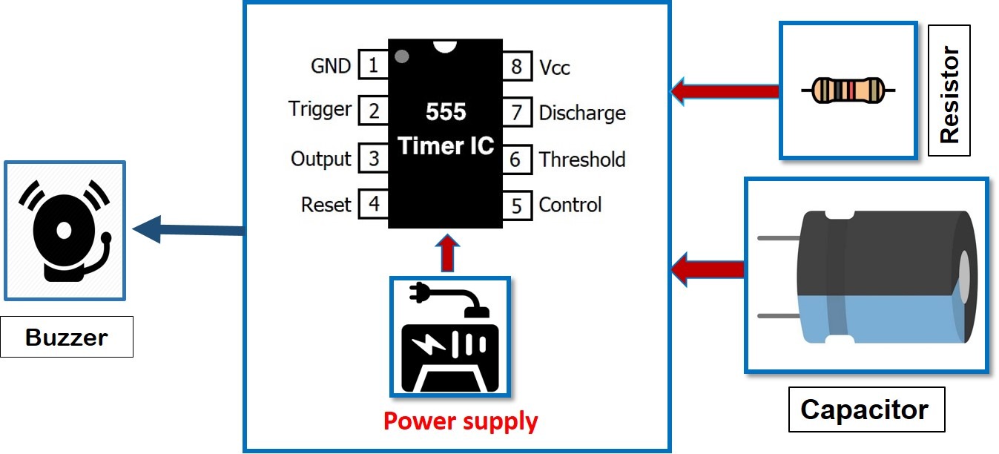
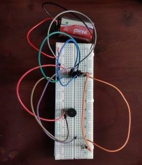

In recent years, the escalating dengue and chikungunya situation in Bangladesh has emerged as a serious public health problem in terms of morbidity and mortality.Analyzing data of recent survey shows how people are being affected by these diseases.

People used several kinds Mosquito repeller such as coil,lotion and chemical based Spray which are not enough effctive and environment firendly and also very costly.

We developed a cost effective and environment friendly Mosquito Repellent model capable of emitting ultrasonic energy of varied frequency that repels or eliminates Mosquitos.The emitting ultrasound of output high frequency(20kHz to 38kHz) do affect the auditory senses of mosquitoes.However,our model do not make any harm hearing ability of human.

This model can be made by using the components are 555 timer, buzzer, switch , battery, Resistor and capacitor which are available and cheap. 

### **📌 Feature**

🔹 **High Frequency Repulsion:** Operates at an inaudible 44 kHz frequency, effectively repelling mosquitoes without disrupting humans or pets.

🔹 **Environmentally Friendly:**

    1.Rechargeable Battery

    2.Recyclable Battery

🔹 **Cost-Effective**

### **🔰 Circuit Diagram**

<figure markdown="span">
{ loading=lazy }
  <figcaption>Circuit Diagram</figcaption>
</figure>

### **🔰 Hardware**

<figure markdown="span">
{ loading=lazy }
  <figcaption>Breadboard Implementation</figcaption>
</figure>

### **🔰 PCB Design**

<figure markdown="span">
{ loading=lazy }
  <figcaption>PCB Layout</figcaption>
</figure>

### **🔰 PCB Implementaion**

<figure markdown="span">
{ loading=lazy }
  <figcaption>PCB Implementation</figcaption>
</figure>

### **🔰 Report**

The report has been made publicly available to to help other students provide a guideline on the basic framework.Please avoid copying entriely or partially from this document. 

🔗[Click here for the Report](https://github.com/Nusrat008/Mosquito-Repellent-Circuit/blob/main/Report%20on%20Mosquito%20Repellent%20Circuit.pdf)

### **⭐ Credit**
As a part of the academic activities, this project has been completed by:

    1. Nusrat Jahan Papri

    2. Jannatul Maua Nazia

    3. Shahida Akther
