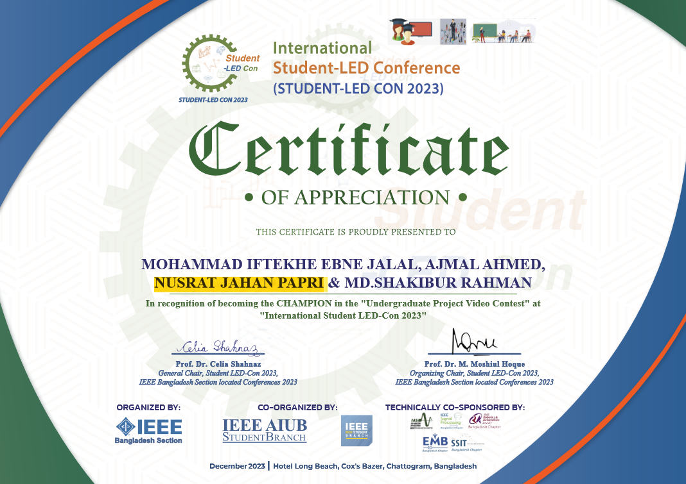
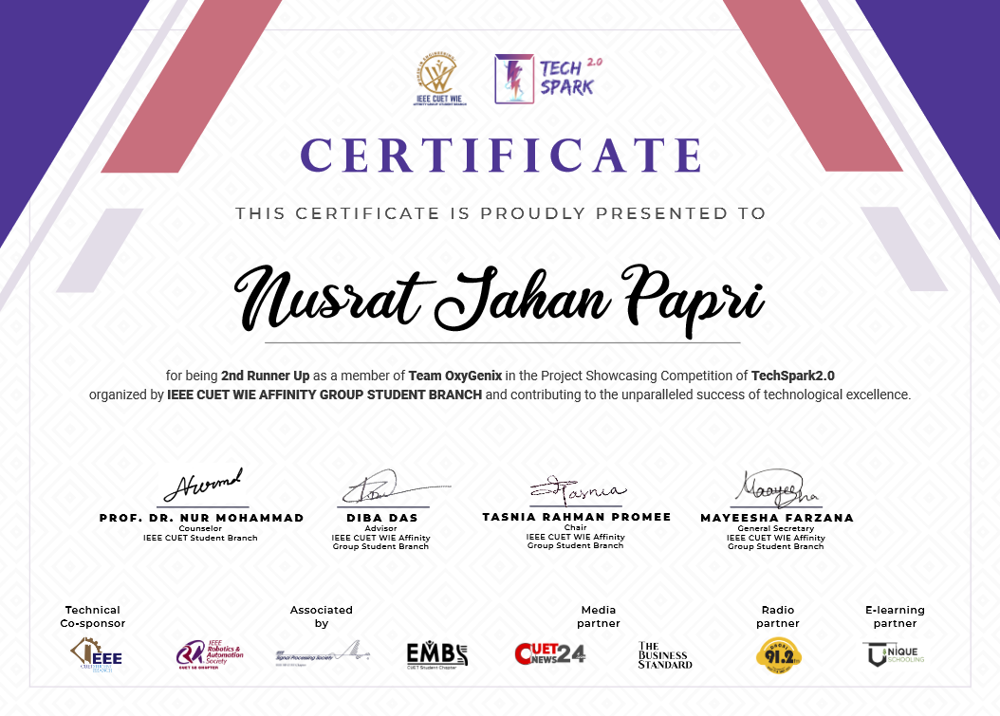
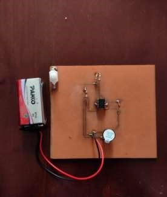

### **🏆CHAMPION    Project in the ''Undergraduate Project Video Contest'' at ''Internaltional Student LED-Con 2023''**
 

**Organizer: IEEE Bangladesh Section** 

Team name: **OXYGENIX**

**Project Details:** 

🔗[Click here to See project details](iot-based-health-monitoring.md)

This project tackles the challenge of infrequent patient monitoring and delayed responses in healthcare, particularly in regions with limited medical resources. 

Our solution is a cost-effective IoT-based health monitoring device that transmits real-time vital signs (heart rate, SpO2, and temperature) to doctors, relatives, and authorized personnel via a user-friendly IoT dashboard.
certificate

**Medical Feature**:

 1. BPM Measurement

 2. SpO2 Measurement

 3. Temperature Measurement

 4. Patient History

 5. No Side Effect 
 

<figure markdown="span">
{ loading=lazy }
  <figcaption>OxyGenix Device</figcaption>
</figure>

<figure markdown="span">
{ loading=lazy }
  <figcaption>Certificate</figcaption>
</figure>

### **Runner Up  in TechSpark 2023**

Organizer:  **IEEE CUET WIE Affinity Group Student Branch**

<figure markdown="span">
{ loading=lazy }
  <figcaption>TechSpark 2023</figcaption>
</figure>

<figure markdown="span">
{ loading=lazy }
  <figcaption>Certificate</figcaption>
</figure>

### **Runner Up Project in 'Basic Electronic, PCB Designing  & Proteus'**

Organizer:  **IEEE CUET STUDENT BRANCH**

**Porject Details:**

🔗[Click here to See project details](Mosquito-repellent-ckt.md)

I developed a cost effective and environment friendly Mosquito Repellent model capable of emitting ultrasonic energy of varied frequency that repels or eliminates Mosquitos.The emitting ultrasound of output high frequency(20kHz to 38kHz) do affect the auditory senses of mosquitoes.However,my model do not make any harm hearing ability of human.

<figure markdown="span">
{ loading=lazy }
  <figcaption>Mosquito Repellent</figcaption>
</figure>

<figure markdown="span">
{ loading=lazy }
  <figcaption>IEEE,CUET</figcaption>
</figure>

<figure markdown="span">
{ loading=lazy }
  <figcaption>Certificate</figcaption>
</figure>

