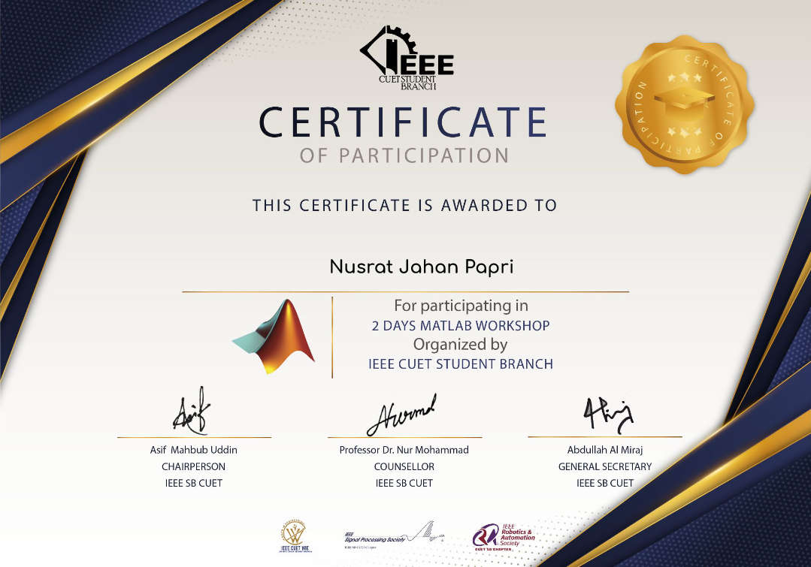

### **Course on 'Engineering Maths and Their Physics & Applications'**

**Part 01**

I completted the Engineering Maths and Their
Physics & Applications course  was taught by Dr. Mahdy Rahman Chowdhury.

I achieved this Recommentdation Letter after properly sumbitting assignment of the 1st half part (1st 6 classes among 12 classes) of the full course: Fourier Series & its transform,Laplace Transform (Physics and real-world applications), Vector calculus (Physics and real-world applications). Each of the classes was minimum 3.5 to 4 hours long.

### 🔗[Recommendation Letter for Part-01](https://drive.google.com/file/d/1bERSfGYb2ZaV18gxRR9Encg-el7E86-p/view?usp=sharing)

🔗[My submitted Assignment ](https://drive.google.com/file/d/12qaRat6VEAWR_rUZAGbx7OyfTduXsyxM/view?usp=drive_link)

### **Part 02**

I also completted the Engineering Maths and Their
Physics & Applications course  was taught by Dr. Mahdy Rahman Chowdhury.

I achieved this Recommentdation Letter after properly sumbitting my well-written assignment that has covered the theory part of the 2nd half (last 6 classes among 12 classes) of the course: Linear Algebra, and Matrix (Physics and real-world applications), ODE and PDE (Physics and real-world applications), part. Each of the classes was minimum 3.5 to 4 hours long.

### 🔗[Recommendation Letter for Part-02](https://drive.google.com/file/d/1ha6HMoOuCyMBxq2zK9zNfRlPZaLf2X19/view?usp=drive_link)

🔗[My submitted Assignment ](https://drive.google.com/file/d/1O-Kew6EHaDc1wsviZeYMEbC7-NzgRUat/view?usp=drive_link)

### **Matlab Workshop**

I participated in a 2 Days Matlab Wrokshop origanized by IEEE CUET STUDENT BRANCH.

<figure markdown="span">
{ loading=lazy }
  <figcaption>Certificate</figcaption>
</figure>
