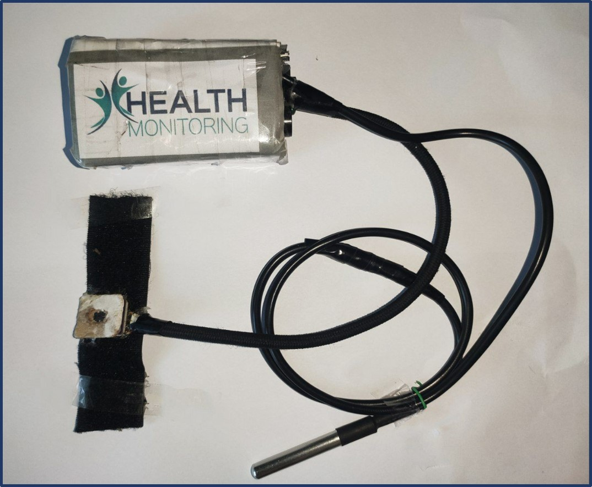

### **IoT Based - Low Cost Patient Health Monitoring Device**

**🏆🏆🏆 CHAMPION Project at Internaltional Student LED-Con 2023, 'IEEE Bangladesh Section located Conference 2023' 🏆🏆🏆**

<figure markdown="span">
{ loading=lazy }
  <figcaption></figcaption>
</figure>
 
<figure markdown="span">
{ loading=lazy }
  <figcaption>OxyGenix Device</figcaption>
</figure>
  

Effective patient monitoring is crucial for healthcare, particularly in areas with limited access to medical professionals.

Our device transmits real-time heart rate, SpO2, and temperature readings to doctors, relatives, and authorized personnel via an IoT dashboard. Additionally, it triggers automatic emergency alerts with location data through phone calls, SMS, and emails, while simultaneously sounding a local buzzer for immediate actions.

Our low-cost, IoT-based health monitoring device addresses key challenges like infrequent monitoring and delayed response. It offers remote access for doctors, automatic emergency alerts (calls, texts, emails) with location data, and reduces healthcare costs by enabling home-based care. This improves overall patient outcomes and accessibility, especially in regions with limited medical resources.

### **📌 Medical Feature**

🫀 **BPM** Measurement

🩸 **SpO2** Measurement

🌡️ **Temperature** Measurement

📈 **Patient History**

✅ **No Side Effect**

### **🧩 Integration and Testing on Admitted Patient of CMCH**

We have gone to Chittagong Medical College Hostipal to integrate our device with real patients in multiple stages including critical, normal and mild conditions to check our device performence.

We got a fine result with accuracy of measurement more than 90%.The Doctor satisfied with the result.

<figure markdown="span">
{ loading=lazy }
  <figcaption></figcaption>
</figure>

### **⭐ Credit**
Engineered by **Team OxyGenix**

1. Ajmal Ahmed Shakib

2. Nusrat Jahan Papri

3. Md.Shakibur Rahman
